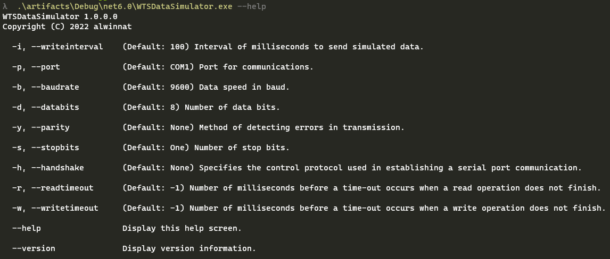
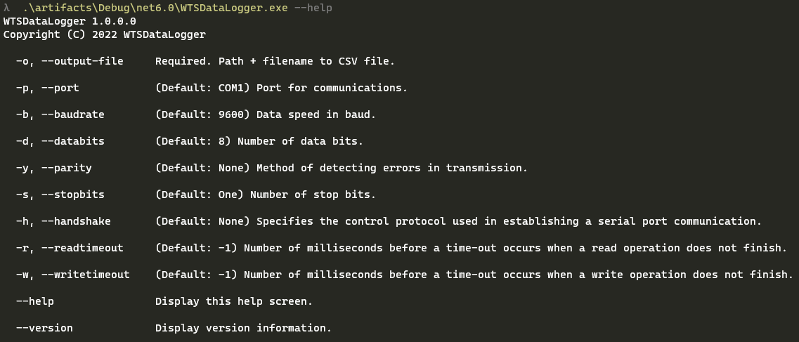
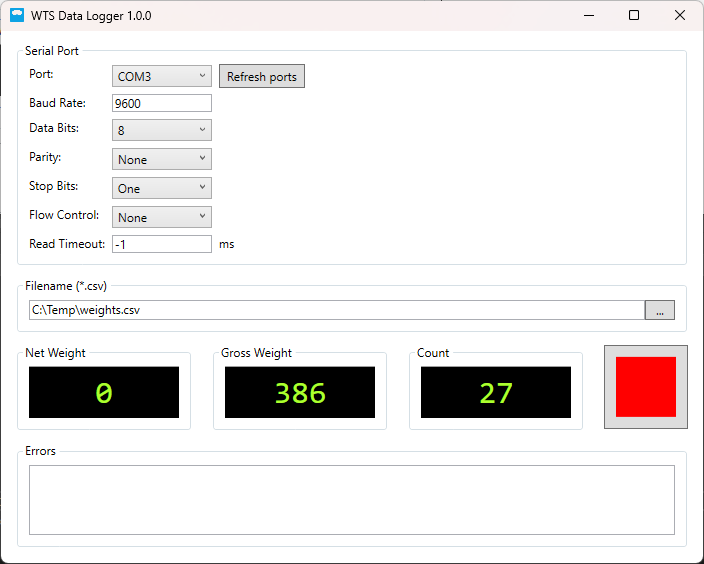
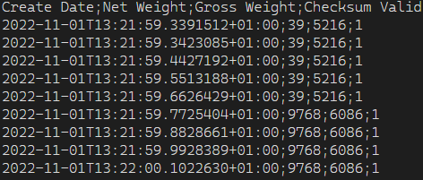

# WTSDataLogger

WTSDataLogger is a free tool to capture measurements from a [Bosche Weight Transmitter (WTS)](https://www.bosche.eu/en/scale-components/weighing-indicators/indicators/weight-transmitter-wts) via a serial communication interface. The captured measurements will be written constantly in a text file (CSV).  

WTSDataLogger consists of 3 applications:

* WTSDataSimulator.exe
* WTSDataLogger.exe
* WTSDataLoggerGUI.exe

> :information_source: Only one transmission protocol in the format '&NxxxxxxLyyyyyy\ckckCR' is currently supported! For more information, see the [manual](https://www.bosche.eu/media/pdf/d1/de/3d/WTS_manual_de.pdf) on page 35. 

## WTSDataSimulator.exe

A command-line application to simulate a [Bosche Weight Transmitter (WTS)](https://www.bosche.eu/en/scale-components/weighing-indicators/indicators/weight-transmitter-wts) for testing purpose.



For example:
```Batchfile
WTSDataSimulator.exe -p COM1
```

A free Null-modem emulator can be found on https://sourceforge.net/projects/com0com/.

## WTSDataLogger.exe

A command-line application to read measurements from a [Bosche Weight Transmitter (WTS)](https://www.bosche.eu/en/scale-components/weighing-indicators/indicators/weight-transmitter-wts) and to write it in a text file (CSV).



For example:
```Batchfile
WTSDataLogger.exe -o C:\Temp\weights.csv -p COM2
```

## WTSDataLoggerGUI.exe

A GUI-based application to read measurements from a [Bosche Weight Transmitter (WTS)](https://www.bosche.eu/en/scale-components/weighing-indicators/indicators/weight-transmitter-wts) and to write it in a text file (CSV).



## Text file format

The text file format is a CSV (comma-separated values) with 4 columns (in the following order):

* Create Date (in ISO 8601)
* Net Weight
* Gross Weight
* Checksum Valid (with '0' for 'transmission error detected' and '1' for 'transmission succeeded')

The separator character is a "__;__".



## Copyright & License

Copyright (c) 2022 alwinnat - Released under the [MIT license](LICENSE).